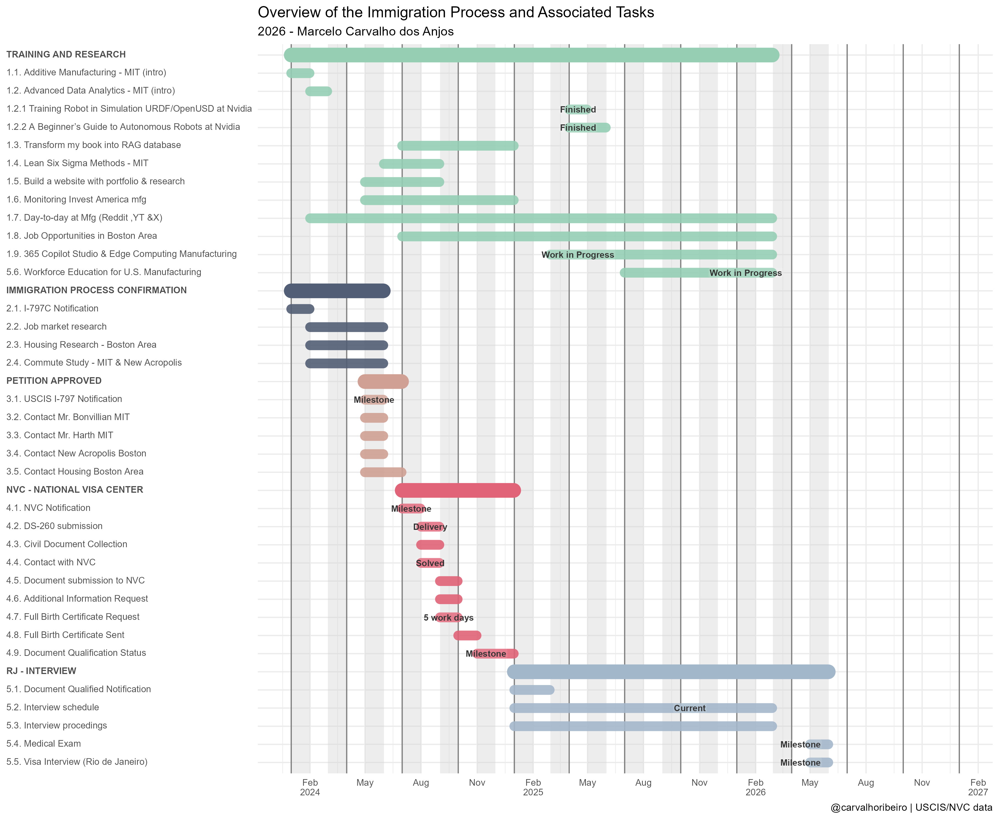

::: panel-tabset
## Immigration Process calendar 2026

## Activity details

**1.1. Additive Manufacturing - MIT(intro):** Completed an introductory course on design and 3D printing using metals, plastics, and other materials.\
**1.2. Advanced Data Analytics - MIT(intro):** Studied industry-focused problem solving through IoT, data analytics, machine learning, and statistical process control.\
**1.3. Book Translation:** Translated my book to English and turning it into a RAG data source.\
**1.4. Lean Six Sigma Methods - MIT:** Completed a course on applying lean principles to manufacturing processes.\
**1.5. Website Portfolio & Research:** Developed and maintain a personal website to showcase ongoing projects, research, and macroeconomic data relevant to my work.\
**1.6. U.S. Manufacturing Investment Monitoring:** Followed news and updates(via YouTube, X, CBS News, CNBC, Bloomberg) on the development of manufactoring facilities by companies like Microsoft, Toyota, SK, Samsung, Tesla, Our Next Energy, and Texas Instruments.\
**1.7. Daily Manufacturing Insights(Reddit, YouTube,X):** Studied real-world challenges in U.S. manufacturing, including supplier negotiations, total cost of ownership(TCO), international trade agreements, logistics, tariffs etc.\
**1.8. Job Market Research - Boston Area:** Research in-demand skills and job opportunities in the Boston region.\
**2.1. I-797C Notification:** Received and reviewed USCIS notifications.\
**2.2. Job Market Analysis - Process Improvement:** Analyzed job openings related to process improvement in the Boston Area.\
**2.3. Housing Research - Boston Area:** Explored housing options and availability in the Boston region.\
**2.4. Commute Study - MIT & New Acropolis:** Assessed routes, public transportation, and travel times from potential neighborhoods to MIT and New Acropolis Boston.\
**3.1. USCIS I-797 Notification:** Received and reviewed important USCIS documentation.\
**3.2. 3.3. 3.4. Contact with MIT Professors:** Reached out to MIT faculty to express interest in workforce-oriented courses and continued philosophy studies at New Acropolist Boston.\
**3.5. Housing Inquiries- Boston Area:** Investigated rental conditions and pricing for housing in the Boston area.\
**4.1. NVC Notification:** Received and reviewed communication from the National Visa Center.\
**4.2. DS-260 submission:** Completed and submitted the DS-260 form.\
**4.3. Civil Document Collection:** Requested and gathered necessary civil documents.\
**4.4. Contact with NVC:** Communicated with the National Visa Center regarding documentation.\
**4.5. Document submission:** Sent required civil documents.\
**4.6. Additional Information Request:** Provided a full birth certificatte("inteiro teor") as requested.\
**4.7. Full Birth Certificate Request:** Requested the full birth certificate from the civil registry office.\
**4.8. Full Birth Certificate Sent:** Submitted the full birth certificate.\
**4.9. Document Qualification Status:** Received confirmation that documents are qualified.\
**5.4. Workforce Education for U.S. Manufacturing Research:** To support ongoing effors in workforce development, I created a new area on my website dedicated to exploring educational models and strategies. A new section of my website now focuses on workforce education research, drawing on foundational contributions from William Bonvillian, Sanjay Sarma, and Benjamin Bloom\
:::

::: panel-tabset
## Business Plan 2026-2027

## Activity details

**1.1. Register the business as an LLC in Massachusetts (Secretary of the Commonwealth)**

**1.2. Apply for EIN through the IRS (free)**

**1.3. Open a U.S. business bank account**

**1.4. Secure a business address (physical/virtual office)**

**1.5. Research local regulations and confirm if a Boston business certificate is needed**

**2.1. Enroll in MIT Advanced Analytics courses and start earning certifications**

**2.3. Update professional profile and company website to highlight MIT affiliation and expertise**

**2.4. Define value proposition for U.S. clients (focus on process improvement + data analytics)**

**3.1. Attend MIT and Boston tech events, meetups, and conferences**

**3.2. Connect with local business associations and chambers of commerce**

**3.3. Research potential clients in manufacturing, supply chain, and tech sectors**

**3.4. Build a list of 20 target companies (IBM, BOSE, etc)**

**4.1. Create marketing materials (pitch deck, one-pager, LinkedIn content)**

**4.2. Start LinkedIn outreach to decision-makers in target companies**

**4.3. Publish thought leadership posts on process improvement and analytics**

**4.4. Explore partnerships with local consultants or small firms**

**5.1. Schedule introductory meetings with prospects**

**5.2. Offer free webinars or workshops on process improvement using analytics**

**5.3. Negotiate and secure my first U.S. client contract**

**6.1. Identify professionals with similar interests (analytics, process improvement)**

**6.2. Begin hiring or forming partnerships for the first small team**

**6.3. Plan service expansion (advanced analytics solutions, training programs)**

**6.4. Set goals for year two: 3–5 U.S. clients and a growing team**

:::
