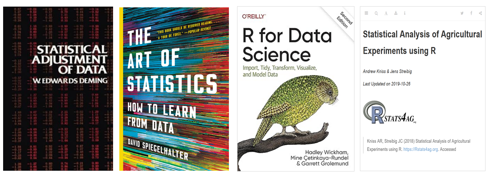
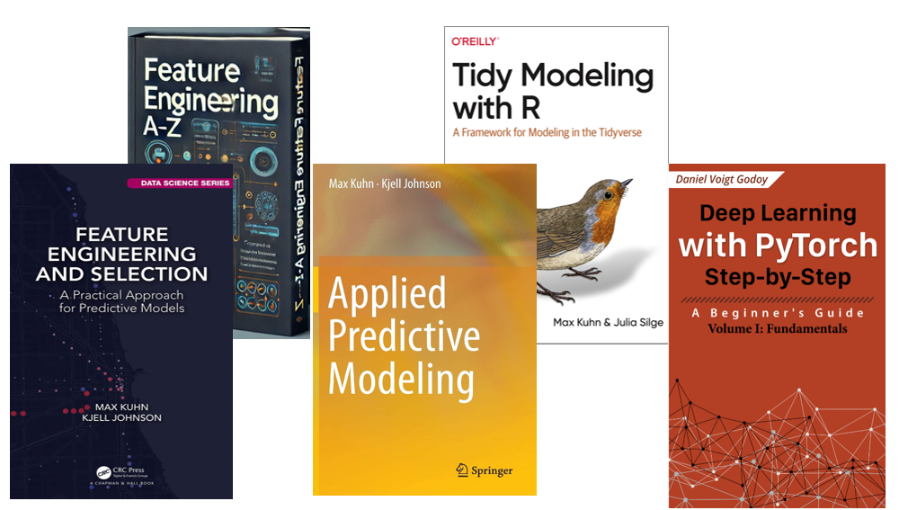
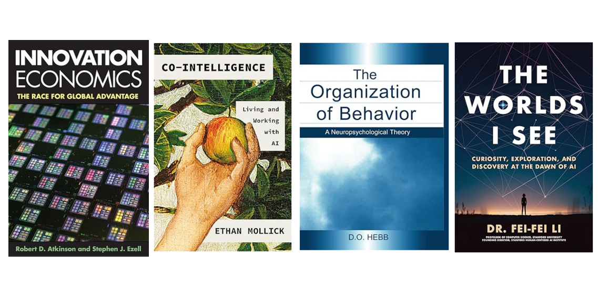

### [**Welcome**]{style="color: #9D0F6A ;"}

-   I am Marcelo Carvalho dos Anjos, a Business & Process Improvement Analyst focused on enhancing manufacturing operations with Lean, PDCA, 5S, and tools like R, Python, Power BI, and AI. I've researched this area since 1995 and worked professionally since 2002.

### [**Goals with this website**]{style="color: #9D0F6A ;"}

- Write about business and process improvement, applying machine learning models to support Lean, PDCA, and statistical methods in manufacturing.

- Tell a story-driven account of my career to inspire my niece Alexis and nephew Noah as they shape their own paths.

- Lay the foundation for muy PhD research on manufacturing competitiveness, personal development, and management capability during economic change.

### [**Education**]{style="color: #9D0F6A ;"}

-   Master's Degree - Agro-industrial Production & Management
-   Bachelor's Degree - Business Administration
-   Trade School - Technical in Agriculture

### [**Experience**]{style="color: #9D0F6A ;"}

-   Process Improvement and Lean principles
-   Data Science and Business Intelligence
-   Statistics and Machine Learning Models
-   Strategic Planning

### [**Who do I learn from?**]{style="color: #9D0F6A ;"}

Below are some individuals I continually learn from through books, lectures, classes, scientific papers, and reflections.

W. Edwards Deming, Max Kuhn, Irene Haas Amaral, Lex Fridman, William Bonvillian, Robert Atkinson, Marilda Martinez de Lima Menes, David Landes, Celso Correia de Souza, Edison Arrabal Arias, Nakata Kenji, Itoshi Kume, Toshiko Narusawa, James Womack, Ivo Martins Cezar, Brian Anthony, John Hart, Pedro Baldoto, Lucia Helena Galvão, Milton Friedman, Allan Greenspan, Jerome Powell, Gary Gensler, Gary Cohn, Rebecca Paterson, Ray Dalio, Douglas Montgomery, Earll Murman, Susan Sheehy, John Shook, George Runger, Julia Silge, Hadley Wickham, David Spiegelhalter, Sanjay Sarma, Raj Shaunak, Ilya Sutskever, Warren McCulloch, Miguel Nocolelis, Anand Avati, Andrej karpathy, Andrew Ng, Fei-Fei-Li,Justin Johnson, Serena Yeung, Geoffrey Hinton, Yan LeCun, Drago Anguelov, Steve Jobs, John Guttag, Bill Aulet, Ed Roberts, Flavio Naoum, Paulo Cezar Naoum, Anderson Roberto, Ana Paula Incerti,Sheila Back, James Wasserman, Mansueto Almeida, Marcos Lisboa, Felipe Salto, Roberto Dumas, Mark Machin, Bharatendra Rai, Marcos Fava Neves, Daniel Sjoberg, Mine Çetinkaya-Rundel, Emily Zabor, Andrew Glassner, Andrew Kniss, Jens Streibig, Michael Bloomberg, David Robinson, Niall Ferguson, Steve Jurvetson, Alboukadel Kassambara, François Husson, Luca Scrucca, Johan Korteling, Anne-Marie Brouwer, Alexander Toet, Sandy Munro,

### [**Helpful Books for Process Improvement**]{style="color: #9D0F6A ;"}

These are some foundational books that help me navigate the daily challenges of my career.

::: panel-tabset
## Data Science

## Machine Learning Models

## Process improvement and engineering

## New World

:::

### [**Inspirations and long-term purpose**]{style="color: #9D0F6A ;"}

Learn relentlessly, pursue excellence, and share knowledge to create opportunity.

<iframe src="https://www.youtube.com/embed/twdg8415WH4?si=nrKzhvcBYseZcO9J" frameborder="0" allow="autoplay; encrypted-media" allowfullscreen></iframe>

### [**What kinds of challenges do I enjoy working on?**]{style="color: #9D0F6A ;"}

I enjoy tackling complex problems to uncover cause-and-effect relantionships.

<iframe src="https://www.youtube.com/embed/_YwrI5SlS8Q?si=l5hkvvqPprCaa0NQ" frameborder="0" allow="autoplay; encrypted-media" allowfullscreen></iframe>

---

Thanks for checking out my web site!
