## [**U.S. Gross Domestic Product (GDP)**]{style="color: #9D0F6A ;"}

**Last update**: Apr, 2026

-   Real gross domestic product (GDP) increased at an annual rate of 2 percent in the first quarter of 2026, according to the advance estimate released on April 30, 2026 (T1). The main drivers were an increase in investment, exports, and consumer spending. In the fourth quarter of 2024, real GDP increased by 1.9%.

-   Personal consumption expenditures increased by 2.0% in the fourth quarter of 2025, compared with 3.5% in the third quarter, according to the second estimate released on March 13, 2026 (T1).

-   Gross private domestic investment increased by 3.3% in the fourth quarter of 2025, compared with 0% in the third quarter, according to the second estimate released on March 13, 2026 (T1). Equipment investment rose by 3.9% in the fourth quarter, compared to a 5.2% increased in the third quarter.

-   Government consumption expenditures and gross investment decreased by 5.8% in the fourth quarter of 2025, compared with a 2.2% increased in the third quarter according to the second estimate released on March 13, 2026 (T1).

-   Personal saving totaled \$929.2 billion in the fourth quarter of 2025. The personal saving rate, as a percentage of disposable personal income, was 4.0% in the fourth quarter, compared with 4.4% in the third quarter, according to the second estimate released on March 13, 2026 (T8).

**U.S. Gross Domestic Product(GDP) for 2024**

In 2024, real GDP increased by 2.8%, compared with a 2.9% increase in 2023, according to the third estimate released on March 27, 2025. The main contributors were consumer spending, investment, government expenditures, and exports.

Source: [Bureau of Economic Analysis](https://www.bea.gov/)

## [**U.S. Inflation**]{style="color: #9D0F6A ;"}

The United States employs several different methods to monitor inflation, and it is crucial to comprehend the distinctions among these measures to gain a clear understanding of economic trends.

**Last update**: March, 2026

**PCE Inflation**

PCE inflation measures the prices of goods and services consumed by households and nonprofit institutions, including food, energy, housing , and more. It is more comprehensive than the Consumer Price Index (CPI). PCE inflation accounts for both direct household spending (you pay) and spending on behalf of households (someone pays for you). For example, when your employer provides health insurance or the government provides Medicare.

-   Compared to the same month last year, the PCE price index rose by 2.8% in January 2026 (T7). The Federal Reserve targets a long-term PCE inflation rate of 2%. From the preceding month, the PCE price index increased 0.3% (T5).

-   Personal income rose by 0.4% in January, 2026 on a monthly basis, according to the estimates published on March 13, 2026 (T3).

**Core PCE Inflation**

Core PCE index is considered a more stable measure of inflation, exclude food and energy prices due to their volatility, focuses on underlying inflation trends, and provides a better understanding of inflationary pressures.

-   When compared to the same month in the previous year, the core PCE price index rose by 3.1% in January 2026, which is slightly higher than the 3.1% increase recorded in December, 2025 (T7).

Souce: [Bureau of Economic Analysis](https://www.bea.gov)

**CPI (Consumer Price Index)**

**Last update:** March, 2026. 

The Consumer Price Index (CPI) measures the average change in prices for a basket of goods and services. It is often used to adjust the cost of living, negotiate wages, and determine Social Security benefits. CPI only accounts for out-of-pocket expentures(expenses you pay directly)

-   The annual inflation rate for the United States increased by 2.4% for the 12 months ending February 2026, compared to the previous rate of 2.4% in January 2026, according to U.S. Bureau of Labor Statistics data.

-   The Consumer Price Index (CPI) rose by 0.3% in February 2026 compared to the previous month.

| Item        | MoM | YoY  |
|-------------|-----|------|
| CPI overall | 0.3 | 2.4  |
| Food        | 0.4 | 3.1  |
| Energy      | 0.6 | 0.5  |
| Services    | 0.3 | 2.9  |
| Shelter     | 0.2 | 3.0  |

-   The CPI for March 2026 is scheduled to be released on March 11, 2026, at 08:30 a.m. (ET).

Source: [Bureau of Labor Statistics](https://www.bls.gov/)

**Last update:** March, 2026. 

-   According to Federal Reserve Economic data, the Consumer Price Index (CPI) increase by 2.43% in February 2026 compared to the same month a year earlier.

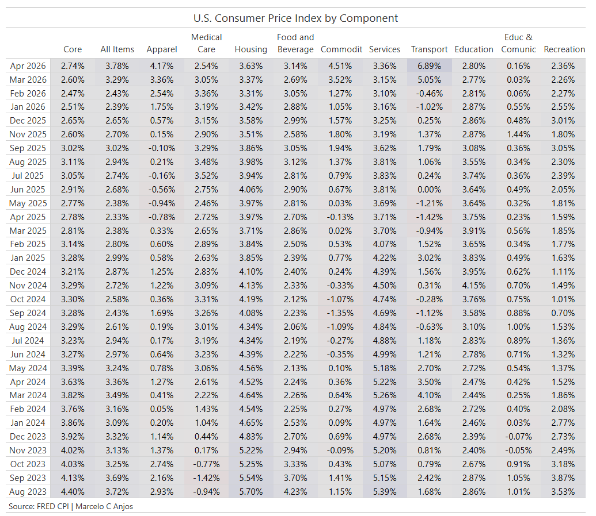 

Source: [Federal Reserve](https://www.federalreserve.gov/publications.htm)

## [**U.S. Interest rates**]{style="color: #9D0F6A ;"}

**Last update:** Apr, 2026

-   The U.S. central bank rate was kept at 3.75% following the most recent adjustment in March 2026

> Our monetary policy actions are guided by our dual mandate to promote maximum employment and stable prices for the American people. At today's meeting, the Committee decided to maintain the target range for the federal funds rate at 3-1/2 to 3-3/4 percent.
>
> The economic outlook remains highly uncertain, and the conflict in the Middle East has added to this uncertanty. In the near term, higher energy prices will push up overall inflation. Beyond that, the scope and duration of potential effects on the economy remain unclear, as does the future course of the conflict itself.
> We will continue to monitor the risks to both sides of our mandate. We are well positioned to determine the extent and timing of additional adjustments to our policy rate based on the icoming data, the evolving outlook, and the balance of risks.
>
> — Jerome Powell, April 29, 2026

---

**Last update:** January, 2025.

-   There was a signal in the Jackson Hole's speech, which marked the end of the four-year cycle of increase in the interest rates by the FED.

-   The new cycle attempts to normalize economy, including indicators like the U.S. interest rate curve, according to the averages of the last hundred years.

-   The decision demonstrates FED's concern for the lower end of the labor market, while de high end is still very tight.

> Normality is a positively sloped yield curve and we think the terminal rate in FED funds is 3%. Where should 10 years be if we're at 3%? We should at least be 100 to 150 basis point positively sloped.
>
> — Gary Cohn, VP of IBM

-   Some indicators that may be evaluated during 2025 are:

    -   Oil.

    -   Commodities.

    -   Shelter (new tenant rents vs old tenant rents).

---

**Last update:** January, 2025.

Chair Powell on a question from Elizabeth Schulze of ABC News(December meeting, 2024). Why do you think it is that inflation is proving to be more stubborn than you'd expected?

> I think people are feeling right now is the effect of high prices, not high inflation. So we understand very well that prices went up by a great deal and people really feel that. And it's prices of food and transportation, and heating your home, and things like that, so there's tremendous pain in that burst of inflation that was very global. This was everywhere in all the advanced economies at the same time. So now we have inflation itself is way down but people are still feeling high prices and that is really what people are feeling. The best we can do for them, and that's who we work for, is to get inflation back down to its target and keep it there so that people are earning big, real wage increase so that their wages are going up, their compensation is going up faster than inflation year upon year upon year, and that's what will restore people's good feeling about the economy.
>
> That's what it will take, and that's what we're aiming for.
>
> — Jerome Powell, December meeting 2024

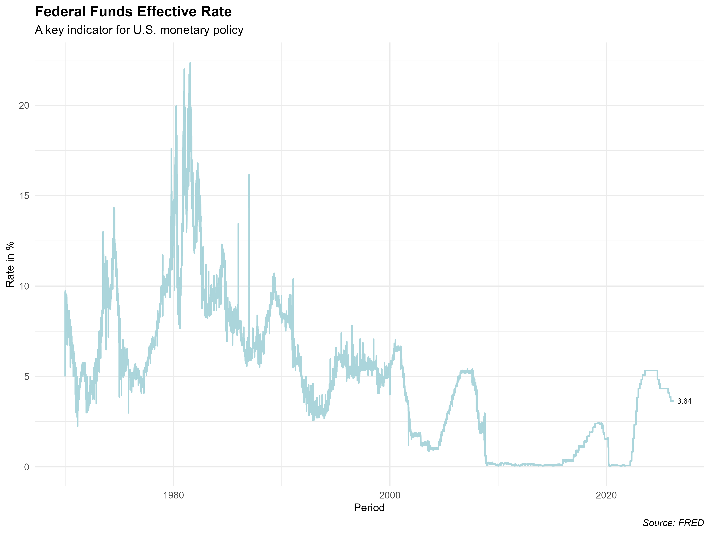

Source: [Federal Reserve](https://www.federalreserve.gov/publications.htm)

## [**U.S. Labor Market**]{style="color: #9D0F6A ;"}

**Last update:** September, 2025.

-   The unemployment rate stood at 4.3% in August 2025. A Job gains in healthcare were partially offset by losses in the federal government and in mining, quarrying, and oil and gas extraction.

-   In August 2025, the unemployment rate was 4.3%, representing 7.4 million people. Of those, 1.9 million were long-term unemployed(*out of work for 27 weeks or more*) accounting for 25.7% of all unemployed persons(TA12).

-   The labor force participation rate declined to 62.3% in August 2025 (TA-1), down 0.4 percentage points from the previous year.

-   One important indicator of the labor market is continuing claims, which track the number of individuals filing for ongoing unemployment benefits each week. This indicator is crucial because it reflects the health of the labor market, signal consumer spending strength, helps identify recession risks, informs Reserve policy decisions, and guides business confidence(all in one metric).

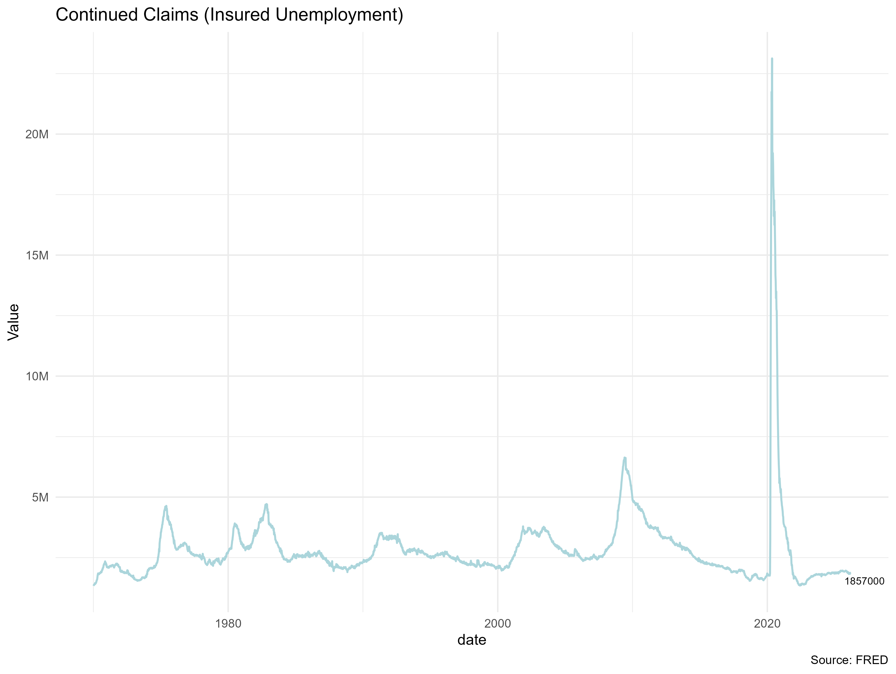

-   Another important labor market indicator is aggregate hours worked. The chart below shows the average weekly hours of all employees in the total private sector. One of the first signs of a slowing economy is a reduction in job openings(that's the first wave). The second wave is a decline in hours worked, which is a critical metric. When employers begin cutting hours, the next step is often cutting positions.

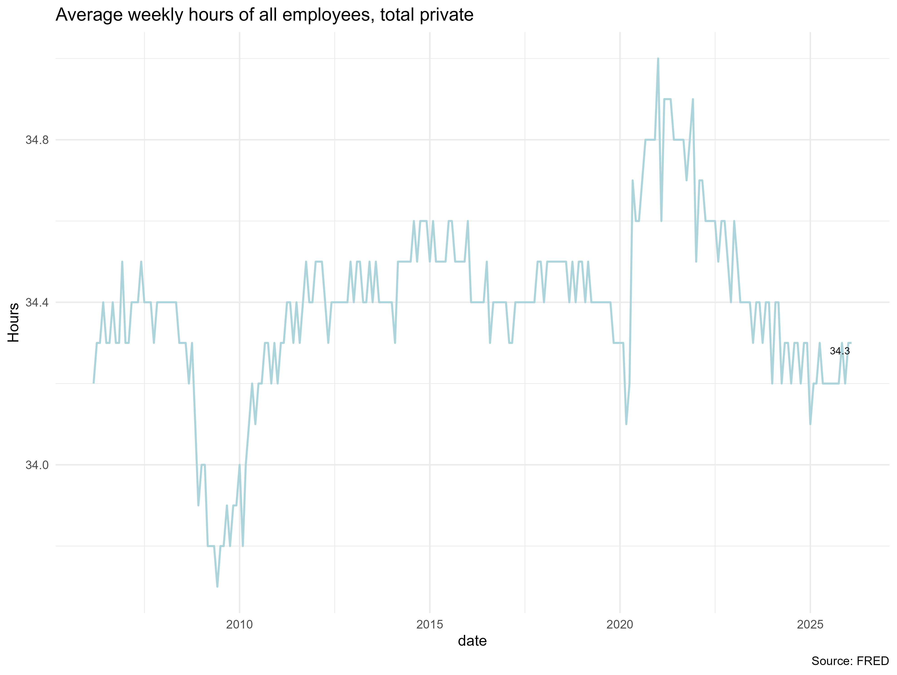

Labor market tightness refers to the number of job vacancies per unemployed worker, and it plays a key role in monetary policy decisions. A very tight labor market may indicate an overheating economy, causing firms to compete for workers and raise wages. If wages grow faster than productivity, inflation can rise. To address this, central banks like the Federal Reserve may increase interest rates to slow down economic activity and reduce labor demand, easing inflation.

A tight labor market can also promote inclusion by helping groups historically facing employment barriers, as firms become more willing to hire and train them. The Federal Reseve's average inflation targeting allows lower interest rates during low inflation, supporting a tight labor market and more inclusive job growth.

The chart below, shared by Mick Dueholm and Serdar Ozkan on the FRED Blog, illustrates labor market tightness as the ratio of job openings to unemployed individuals. This measure indicates how many job opportunities are available for each person seeking work.

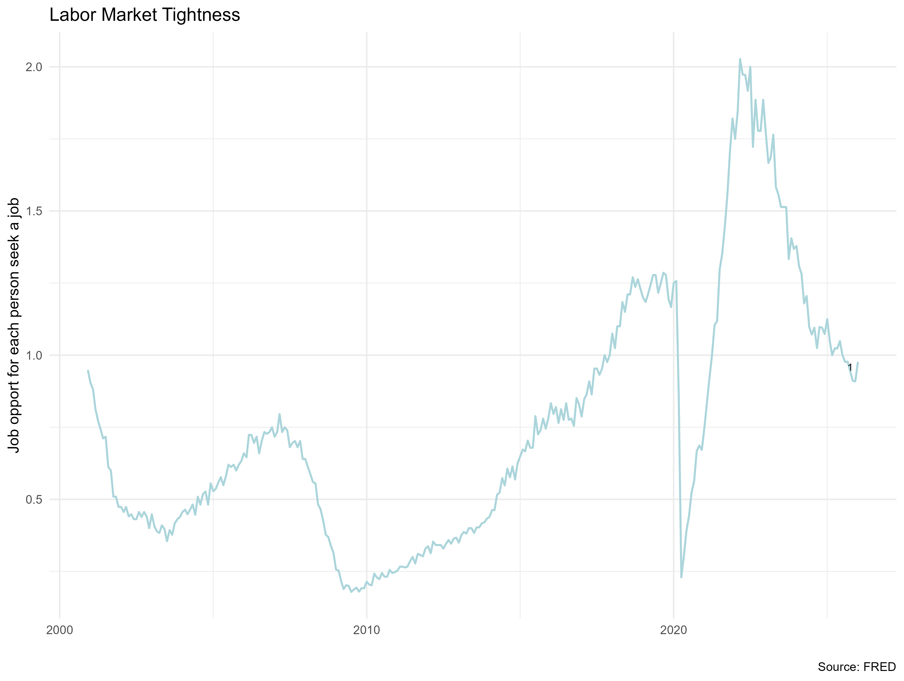

Source: [U.S. Bureau of Labor Statistics](https://www.bls.gov/) , [U.S. Departament of Labor](https://www.dol.gov), and FRED.

## [**U.S. 10-Year Treasury bonds**]{style="color: #9D0F6A ;"}

**Last update:** September, 2025.

-   The 10-year Treasury yield is a key indicator of investor sentiment about the economy. It represents the interest rate the U.S. government pays to borrow money for a decade and serves as benchmark for other interest rates. This yield influences borrowing costs, affects the valuation of financial assets, and reflects expectations about inflation and economic growth.

-   The chart below shows the United States 10-Year Government Bond yield.

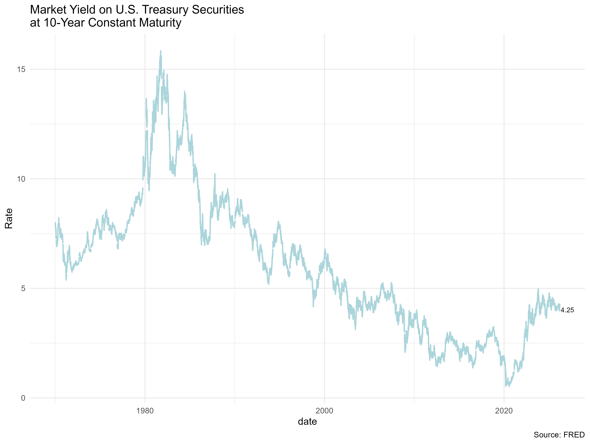

- The spread between Moody's Baa corporate bond yield and the 10-year Treasury yield is a key measure of credit risk and economic sentiment. It reflects how much extra return investors demand for holding riskier corporate debt over safe government bonds. A widening spread signals rising concern about corporate defaults or economic slowdown, while a narrowing spread suggest confidence in the economy and corporate health. This indicator often move with the business cycle and can act as a leading signal of recession or recovery. Investors and policymakers use it to assess market stress, risk appetite, and monetary policy impact.

- Historically, a spread above ~2.5% has often preceded recessions, while a spread below ~1.5 suggest economic strength.

- Fixed-income investors use the spread to gauge relative value between corporate and government bonds. A high spread may signal undervalued corporate bonds(if default risk is overestimated), and a low spread may indicate overvaluation or excessive risk-taking.

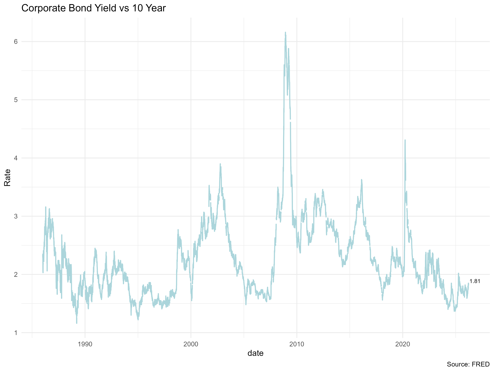

Source: [Yahoo finance](https://finance.yahoo.com/), [FRED](https://fred.stlouisfed.org/series/DGS10/)

## [**U.S. Yield Curve**]{style="color: #9D0F6A ;"}

**Last update:** September, 2025.

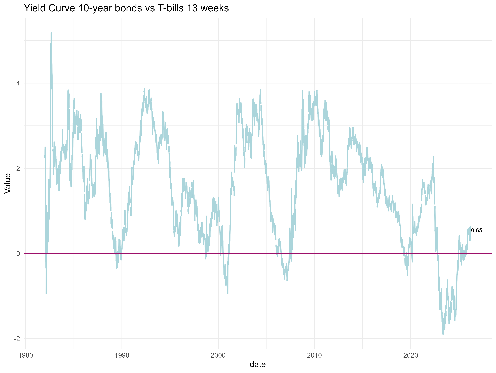
Source: [FRED - Federal Reserve Bank of St. Louis](https://fred.stlouisfed.org/)

## [**U.S. Sectors 2Q24**]{style="color: #9D0F6A ;"}

### [**Overall**]{style="color: #9D0F6A ;"}

**Last update:** January, 2025

Revenue-related cash flow remains a challenge, impacting supply chains, the labor market, and debt costs specially since some of theses are tied to revwnue performance. In such cycles, highly leveraged companies often file for bankruptcy, which is important to monitor due to increased volatility. The perception of high interest rates and monetary tightening makes it difficult to pass costs on to consumers, prompting businesses to adjust their operations in pursuit of greater efficiency. Other observed behaviors include:

-   There has been a temporary rise in unemployment rates, though without any sudden shifts. Job losses are beginning to occur primarily among workers with lower levels of skills, education, and income-generating capacity. These indicators are being closely monitored by Federal Reserve officials, and signs of concern can be seen in Chairman Powell's recent statements.

-   Companies are making decisions to reduce costs of goods sold(COGS) and operating expenses(SG&A).

-   Temporary increase in the cost of capital for private debt.

-   Reorganization of supply chains.

### [**Agroindustry**]{style="color: #9D0F6A ;"}

**Last update:** January, 2025

-   2023 was an incredible year for agriculture, with high productivity for wheat and corn. In 2024, the harvest is a little late(e.g South Dakota area). There was high intensity of rainfall at the beginning of planting with mild temperatutes, causing the crop not to develop as much as in 2023. During the wheat harvest, usually in August, the corn needs more rain to fill the grain, but this year there was not so much during this period.

-   The distortions generated during the pandemic is make 2024 a year of adjusments that are being faced by growers, agricultural auto manufacturing, and machinery and equipment sales, temporarily affeting jobs.

-   Looking for agricultural prices, they are still not good. The expectation is not for a bad year, but it will not be as good as 2023. Sales of new equipment have fallen, making it necessary to adjust costs and expenses in companies such as John Deer and CNH industrial.

### [**Automotive**]{style="color: #9D0F6A ;"}

**Last update:** January, 2025

-   The automotive industry faces many challenges in 2024. Slowing growth, increased competition, supply chain disruptions generated during the pandemic and business decisions caused distortions in costs and prices that grew way above the population's income and general inflation rates. This process may take a few years to stabilize.

-   The volume of new car sales does not follow the same trend as population growth. It requires a deeper analysis to identify cause-and-effect relationships, but for now, the hypotheses raised are accessibility and the durability of the vehicles acording to @autolinenetwork2024.

    -   From a price perspective, historically, it takes 25 weeks of average household income to buy a new vehicle. The average household income in 2024 is \$75.000 (\$1.400 per week) which would be enough to buy a vehicle worth \$36.000 dollars.

    -   The age of the vehicles on the road in the United States is 12.6 years acording to @parekh2024

    -   The average cost of car ownership in 2024 was around \$12,000 annually according to BLS (vehicle purchase 46%, fuels 22%, finance charges 3%, repairs 8%, insurance 15%, others 6%)
    

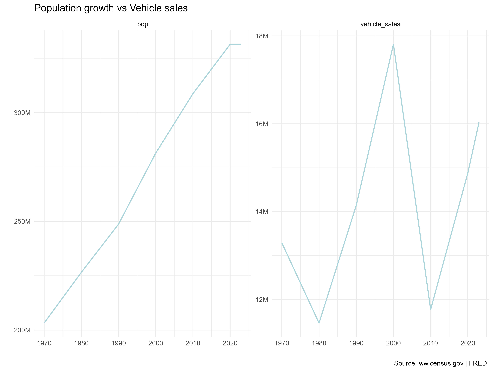

-   Financial data from auto industry in the second quarter of 2024.

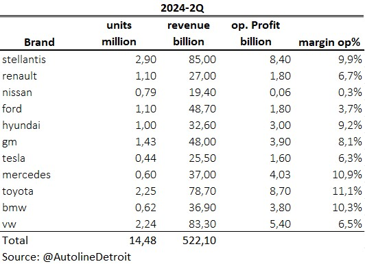

-   Reducing costs and prices, increasing household income, and finding more sources of revenue such as subscription services are some options that can be observed in the market.

-   Some car manufacturers are discovering and applying new materials that that awaken the perception of confort and refinement in consumers and this has been reflected in their choices.

### [**Transportation**]{style="color: #9D0F6A ;"}

**Last update:** January, 2026.

Between 2020 and 2025, there was overcapacity in the carrier population due to fluctuating demand, wich remais inconsistent and is currently undergoing adjustments. Despite this, capacity level are still high relative to shipment volumes, putting pressure on logistics providers to streamline operations and pursue efficiency gains. Some carriers are downsizing and reducing freet sies to adapt. On the other hand, the total number of carriers declined by 33,200 between December 2022 and October 2024.

-   Diesel prices are \$3.51 per gallon in January 2026, -7,8% compare with \$3.81 per gallon in 2019.

-   Dry van rates in the spot market are currently \$2.15 per mile, down 0.5% YoY and down 2.8% compared to 2019(\$2.21).

-   Reefer rates in the spot market are currently \$2.53 per mile down 7% YoY and 0.1% compared to 2019(\$2.53).

-   Flat bed rates in the spot market are currently \$2.35 per mile up 6.3% YoY and down 6.6% compared to 2019(\$2.52).

### [**Technology**]{style="color: #9D0F6A ;"}

**Last update:** September, 2025

-   In 2025 investments in disruptive technologies continue to show accelerated growth. The highlight has been in data center, generative AI for the cloud, personal computers, smartphone devices, and factory floor which is unlocking possibilities for innovation between interconnected processes such as robotics, augmented reality, and autonomous vehicles.

-   Factors such as macroeconomic, geopolitical environment, and intense competition influence the adoption of technology as alternatives to improve operational efficiency in business.

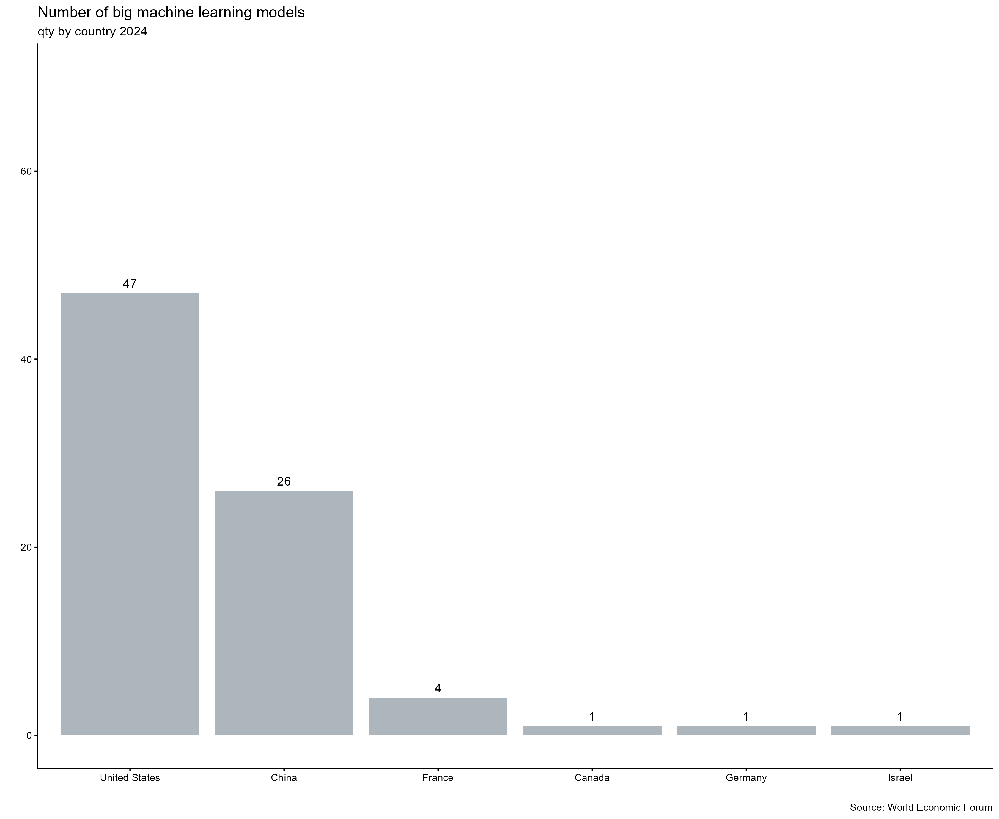

-   The innovation process has accelerated, driven by the development of large generative AI models, known as foundation models. These foundation models are then utilized by specialized applications that build upon them to perform more specific tasks. Finally, traditional processes are leveraging the applications to achieve efficiency gains, create new processes, and develop new value-added products.

**Infraestructure**

-   **Computing:** xAI(Memphis, TN Phase1 concluded, 2nd in 2026), Amazon (Madison County, MS:2027), Google(Mesa, AZ, Lincoln, NE), Microsoft(Mount Pleasant, WI:2025),Meta(Jeffersonville, IN) Nvidia, (OpenAi, Oracle, Softbank, Abilene TX:2030)

-   **AI foundation models:** OpenAI(Msft), Anthropic(Google/Amazon), Cohere(Nvidia), Grok-3(xAi),Gemini-2(Google), DeepSeek-R1(DeepSeek)

-   **AI Software Service:** Palantir

-   **Synthetic data:** Hazy(Microsoft), Sogeti, Epistemix, Mostly AI, Facteus, Sythesis AI, Datavant, Statice, TonicAI, SBX Robotics.

-   **Data Annotation:** Scale AI, Appen, Openxcell, SuperAnnotate, iMerit, Labelbox, Cogitobox, CloudFactory, Hive

**Horizontal AI**

Horizontal AI refers to AI systems that have a broad range of capabilities and can be applied across multiple industries, domais, or tasks. These systems are often more general-purpose and can be trained on a wide range of data sources(e.g. natural language processing in virtual assistant, general purpose machine learning frameworks like pytorch or tensorflow, cognitive architectures etc.)

-   **AI commpanions(autonomous agents and worflows):** Adept e Inflection(msft, nvda), Cognosys e graft(goog), Imbue(amzn, nvda)

-   **Digital Twins:** blackshark.ai (msft), Siemens TeamCenter X, Autodesk Revit @nvidia2024

-   **HR:** moonhub(goog), smartymeet(amzn)

-   **Productivity & knowledge management:** essential AI(goog, nvda), Humata(goog), Redactabl(goog)

-   **Marketing and sales:** Outreach(msft), Speedy(goog)

-   **Search:** perplexity, twelve labs(nvda)

-   **Stell tech:** osmo(goog)

-   **Software development:** Bulder.ai (msft)

**Vertical AI**

Vertical AI are often designed to perform a specific task or set of tasks within a particular industry or domain, and to integrate with existing systems and workflows within an organization, making them useful for solving specific business problems.Theses systems are typically narrow in their focus and are trained on a specific dataset or set of rules to excel in the specific area(e.g. img recognition for medical diagnosis, sentiment analysis tools for custormer service, predictive maintenance for mfg equipment etc).

-   **Agriculture:** Bowery(goog)

-   **Education:** Elsa(goog)

-   **Healthcare/life science:** Charm, Generate Biomedicine, Genesis therapeutics, Lambic, Inceptive, Superliminal, flyweel(nvda), layer health, seismic, tidalflow(goog), paige, flyweel(msft)

-   **Manufacturing:** machina labs(nvda), nobble.ai(msft), veo robotics/symbotic, agility robotics, bionichive, mantis robotic, Modjoul, Vimaan(amzn).

-   **Real Estate:** jitty(goog)

-   **Warehousing and logisticis:** flymingo(amzn), gatik, invia, nautilus labs, netradyne, nextbillionai(msft) outtrider, serve(nvda)

-   **Waste management:** amp robotics(msft)

**Last update:** February, 2025

### [**Housing market**]{style="color: #9D0F6A ;"}

**Last update:** September, 2025

-   The U.S. median home price in 4Q24 is \$419.200 compared to \$423.200 last year, a decrease of 0.95% and -5.3% compared to the price peak in 4Q22.

-   Spring is busiest time for the housing market in U.S. starting in April and peaks in June when the average number of existing homes sold per day increases significantly, and historically, home prices tend to rise during this period. On the other hand, in 2021 and 2022 home prices rose 16.7% and 13%, respectively, way above the personal income and this factor may change the effect of this year season. With builders facing challenges in passing on costs to consumers, improving proceses can be a relevant factor in avoiding or minimizing the effects on margins.

-   The plot below shows the behaviors from the perspective of supply and demand.

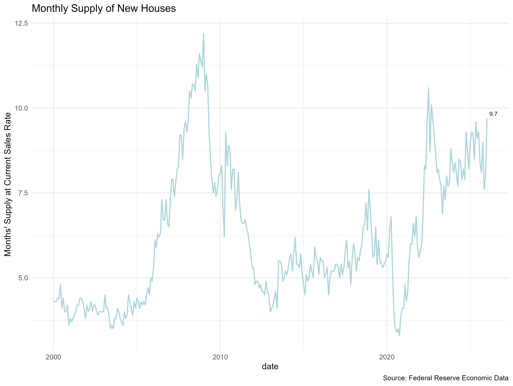
-   In 2025 home buyers are looking for better prices and interest rates, two family homes with smarter technologies and other factors that may be relevant such as a gyms, ceilling fans, energy star rated windows, patio, hardwood floors in the living areas, and side-by-side kitchen sink, and close to fun and public transportation.

-   One modality that has been gaining traction is built-to-rent commnunities driving for some factors:

    -   **Affordability constraints:** Rising home prices and higher mortgage rates have priced many out of homeownership.
    -   **Desire for flexibility and amenities:** Renters increasingly seek convenient, maintenance-coworking facilities.
    -   **Demographics:** Millenials, GenZ, and retirees are opting for rental lifestyles.
    -   **Changing household dynamics:** The growing number of single-person households. The share of people living alone increased every decade from 1940 to 2020 according to @bureau2023. In 2020 the proportion was 27.6% compared to 26.7% in 2010.

-   Some indicators that may be evaluated during the next three months are:

    -   Mortgage rates, increasing inventories, listing price, time homes are on market.
    -   Net new home orders that represent the number of new sales contracts that have been finalized and signed by buyers minus customer home order cancellations booked.
    -   Companies financial guidance such as Lennar, Toll Brothers, D.R. Horton, Pultegroup and KB Home.
    

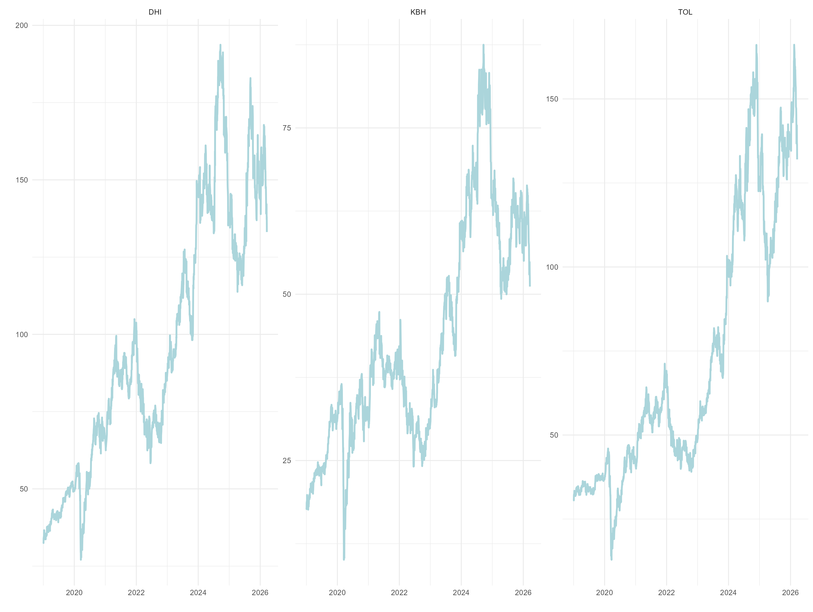
  

**Source:** [Federal Reserve Economic Data](https://fred.stlouisfed.org/) ;[US Census Bureau](https://www.census.gov/)

### [**Manufacturing**]{style="color: #9D0F6A ;"}

**Last update:** September, 2025

-   In 2024, the United States manufatured over 18% of global high-technology goods.This scenario is changing rapidly.

-   Looking at gross private domestric investment, it has been growing 7.6% in 2024. Below is an overview of private investments the manufacturing sector.

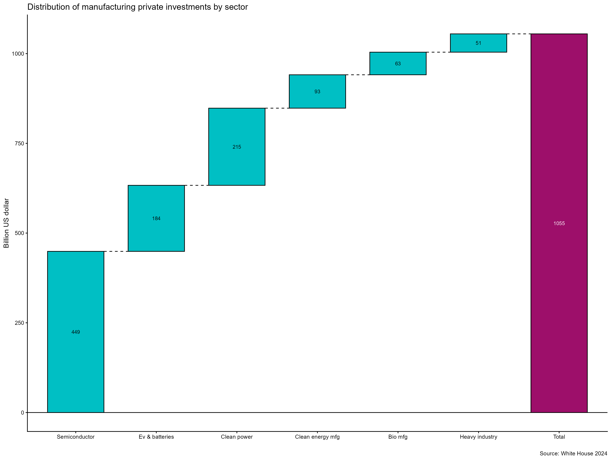

-   Looking at the manufacturing plants construction sites.

    -   **Semiconductor:** TSMC (Phenix, AZ:TSM: fab1 production pilot Dec24, fab2 under construction, fab3 2nm chips next 10 years) , Wolfspeed(Siler City Chatham County,NC and Mohawk Valley,NY:WOLF), Intel(Licking County, OH:INTC), SK Hynix(West Lafayette, IN), IBM(Hudson Valley, NY), GlobalFoundries(Essex, VT:GSF), Samsung(Taylor, TX:SSNLF), Texas Instruments(Sherman, TX:TXN)

    -   **Batteries:** Sakuu & SK on, Toyota (Liberty, NC:Production pilot Apr25 300k EV, 150K PHEV, 800K HEV annual production, 10 lines for EV and 14 lines for Hybrids), LG Energy(Queen Creek, AZ), Redwood (Reno, NV), Panasonic(De Soto, KS:WIP Start production in Spring25), Ford SK (Stanton, TN:WIP Delay until 2027), SK on/Nissan (Canton, MS: Start 2028), Ultium Cells(Spring Hill, TN:2027 and Lansing MI:2025)

    -   **Biomanufacturing:** Moderna(Marlborough,MA), Pfizer(Peral River, NY), Thermo Fisher(Greenville, NC), Novo Nordisk(Clayton, NC), Fujifilm(Holly Springs, NC), Genentech(Oceanside, CA)

    -   **Heavy Industry:** Norsk Hydro(Cassopolis, MI), Altex Heat Exchanger(Columbus, MS), Nucor(Kingman, AZ), GE Appliances(Louisville, KY), JSW Steel(Mingo Junction, Ohio)

    -   **Clean Power:** Tesla Energy, Buffalo Branch Wind, Skipjack Offshore Energy, Engie NA, GE Hitachi SMR(RWRX-300), TerraPower, X-Energy, Hyperion Power Generation. Westinghouse eVinci SMR. Ultra Safe Nuclear Comporation(USNC), Colossus Power Plant(Southaven, MS).

    -   **Clean Energy Manufacturing:** Boom Supersonic(Greensboro, NC), Electric Hydrogen(Devens, MA), Siemens Gamesa(Port of Coeuumans, NY)

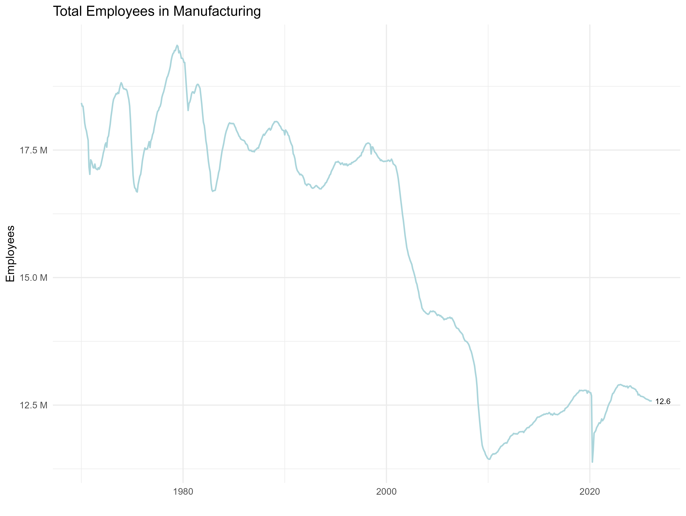
**Training and education**

-   **Training programs** In the training and labor force perspective, several ongoing initiatives such as educational programs, some specific to women in the semiconductor field such as Fresh Start Semiconductor Program @pbsnewshour2024.

-   Partnership between Toyota battery plant and Randolph and other Community Colleges to provide initial training(Jan2025).

-   **Community college** are crucial in preparing young people for entry-level positions in U.S. manufacturing. In 2023, there are approximately 1,476 community colleges in the United States according to @wellington2023 . These institutions offer two-year programs, vocational training, and pathways to four-year universities. California, Texas, and New York hosting the largest numbers. Community college students also are among the more diverse in postsecondary education acording to @education2024

Some stats about community colleges that I find at @parker2024

-   51% of students are 21 years old or younger

-   80% of college students who begin their education aspire to attain a bachelor's degree or higher.

-   Community colleges generate 16.6 billion dollars in revenue from tuition fees.

-   2/3 of undergraduate students attended a community college after high school

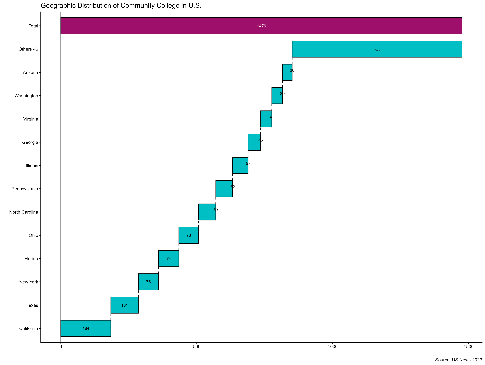
