## Bertin S/A (1999-2009)

### [**Business**]{style="color: #9D0F6A ;"}

Bertin S/A was a beef protein producer later integrated into JBS Global through its merger with Friboi.

### [**Goals**]{style="color: #9D0F6A ;"}

Led process improvements initiatives across twelve plants, delivering over fifty projects in seven states and training teams in Lean, PDCA, and production optimization.

### [**Activities**]{style="color: #9D0F6A ;"}

-   Deployed a low-latency BI system across nine plants.
-   Built a linear-programming planning tool to drive strategic decisions and reduce COGS(cost of good sold).
-   Trained teams of operators, supervisors, and managers in Lean manufacturing principles and BI tools.
-   Led fifteen Kaizen projects focused on energy efficiency, production processes, slaughter, deboning, and supply chain optimization.

### [**Accomplishments**]{style="color: #9D0F6A ;"}

-   Reduced COGS by 2%, saving $27M(2007).
-   Enabled the commercial team to define and present the optimal product mix,
-   Cut energy consumption by 10%, from 90 to 81 kWh/ton(2009).
-   Recuded average truck loading time by 17%. 
-   Lowered carcass weight loss during chilling by 0.42%, saving ~$2M per plant(2009).

::: panel-tabset

## Strategic Model Summary

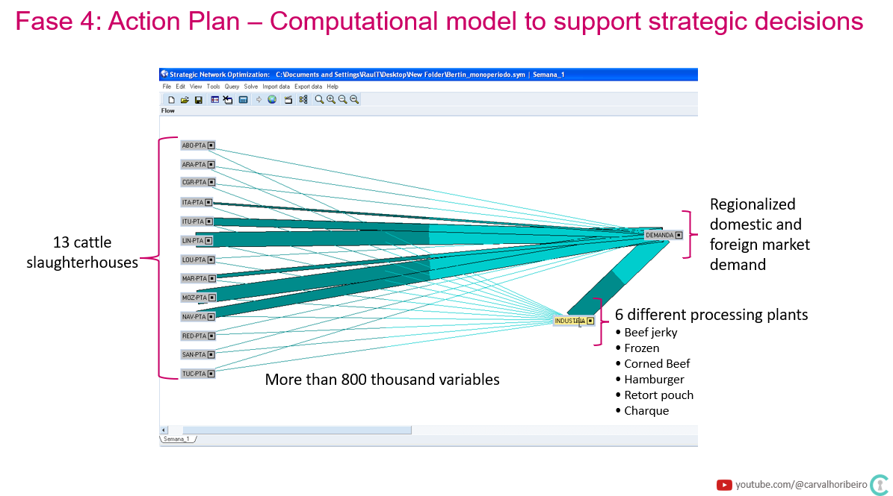

## Strategic Model Detail

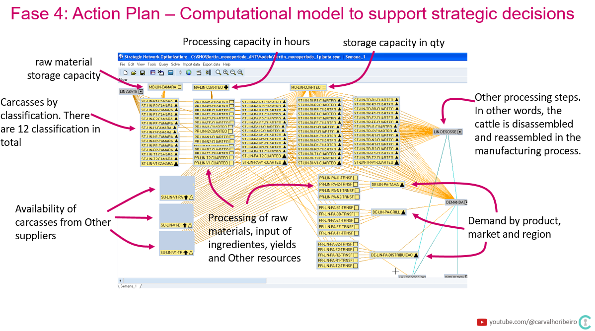

## Operational Kaizen Projects

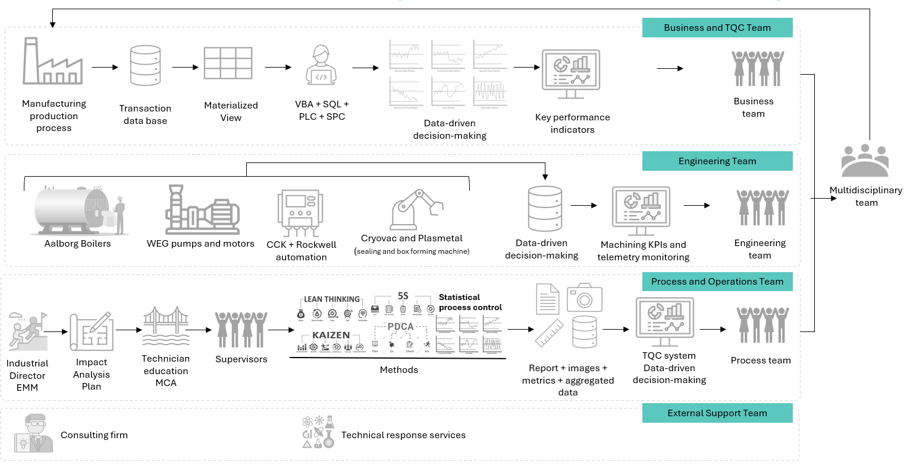

:::

## GovBR  (2011-2012)

### [**Business**]{style="color: #9D0F6A ;"}

GOVBR is a private software company focused on public sector management.

### [**Goals**]{style="color: #9D0F6A ;"}

I supported the company's valuation during the M&A process by building compliance, transparency, and a data-driven decision system.

### [**Activities**]{style="color: #9D0F6A ;"}

-   Mapped and standardized financial processes.
-   Structured the business intelligence function with a focus on controllership processes across five companies withing the business group.
-   Created a new SQL Served database to store historical financial and operational data.
-   Developed dashboards using QlikView to monitor performance metrics.
-   Analyzed balance sheets and financial statements to identify improvement opportunities and implement changes.

### [**Accomplishments**]{style="color: #9D0F6A ;"}

- Redesign the P&L to clarify KPIs while maintaining full compliance and transparency, using BI tools and disciplined public-company reporting standards.
- Simplified the presentation of operational and financial results, both spoken and written.

::: panel-tabset

## Business process map

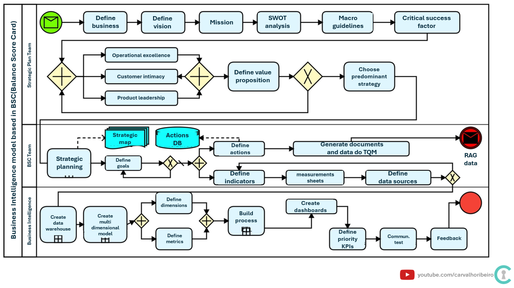

## Dimentional modeling

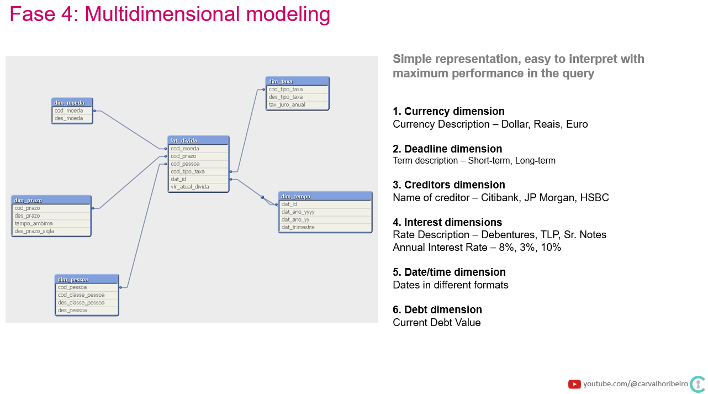

:::

## Portobello Shop (2014-2016)

### [**Business**]{style="color: #9D0F6A ;"}

Portobello Group is a premium ceramic tile manufacturer with production facilities in Tijucas, Brazil(SC), and Baxter, Tennessee(USA), employing approximately 4,000 people.

### [**Goals**]{style="color: #9D0F6A ;"}

My role supported three strategic priorities: store expansion, same-store revenue growth, and service quality improvement.

### [**Activities**]{style="color: #9D0F6A ;"}

-   Mapped and improved internal processes through execution and monitoring.
-   Enhanced data quality and UI for Neoway Radar to support external sales.
-   Trained teams and produced user documentation for new tools.
-   Delivered KPIs and dashboards aligned with strategy.

### [**Accomplishments**]{style="color: #9D0F6A ;"}

-   Raised store openings from 8 to 12 per year.
-   Drove 86% external sales growth in 2015.
-   Upgraded the web portal to better serve customers and staff.
-   Increased Neoway Radar adoption by 44%

::: panel-tabset

## Quantitative results

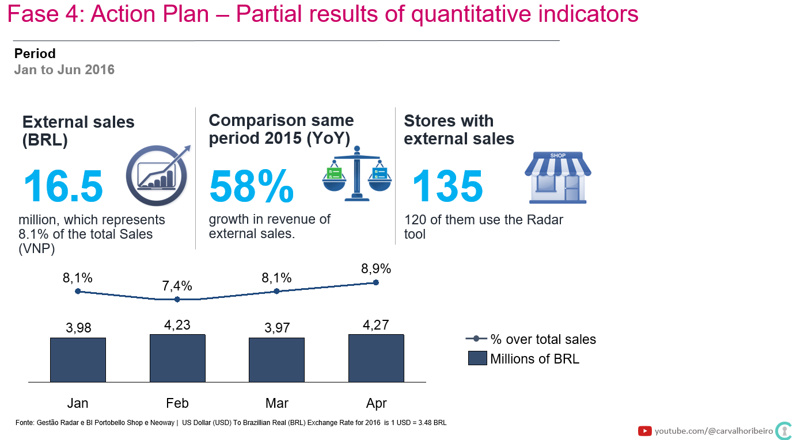

## Improvements

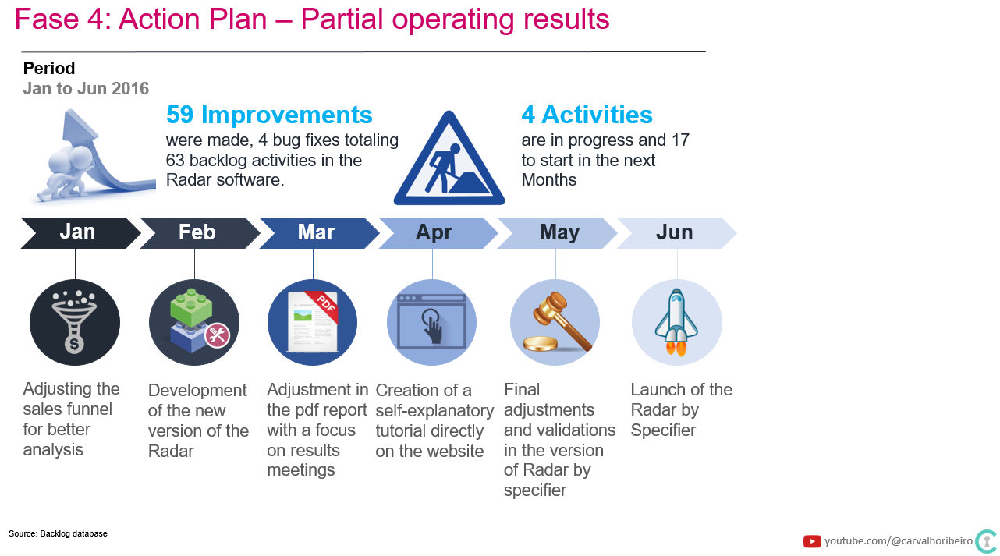

:::

## Delta Brindes (2019-2024)

### [**Business**]{style="color: #9D0F6A ;"}

Delta manufactures and distributes corporate gifts nationwide in Brazil, serving over 2,000 customers.

### [**Goals**]{style="color: #9D0F6A ;"}

Scaled fulfilment operations, ensured service quality, implemented ERP and BI systems, documented processes, and trained teams.

Later supported executive decision-making with data, with expanded responsabilities to:

- Antecipate macroeconomic trends and protect financial resources while improving allocation, diversification, cash flow, and long-term sustainability.
- Improve service for existing customer.
- Identify and attract new customers.
- Increase revenue for the existing base.

### [**Activities: Strategic**]{style="color: #9D0F6A ;"}

-   Built a Qlikview BI platform integrating macro, sales, pricing, market sentiment, and operations data.
-   Used data to inform CEO-level strategic decisions.
-   Led ERP implementation, including process design and training.
-   Migrated BI to Power BI and adapted data pipelines for RAG-based AI automation

### [**Activities: Operational**]{style="color: #9D0F6A ;"}

-   Managed daily operations, mapped business processes, and implemented improvements.
-   Documented workflows and trained teams in distribution planning, shipment coordination, customer communication to streghthen relationships  with customers and suppliers.

### [**Accomplishments**]{style="color: #9D0F6A ;"}

-   Cut shipping errors by 98% and reduced setup time from one day to 20 minutes.
-   Implemented ERP and BI systems and trained teams.
-   Drove 150% revenue growth (2019-2022)

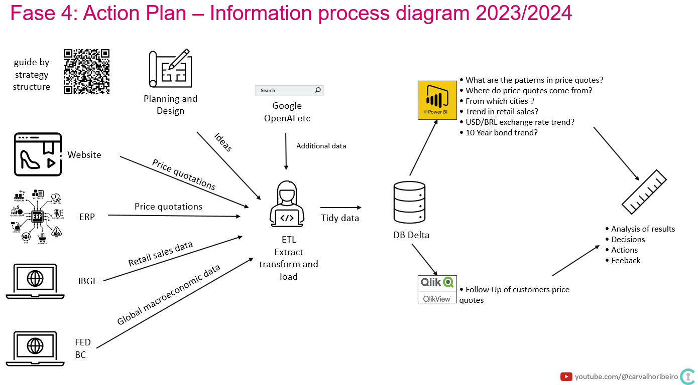

## Delta Brindes(2024-2025)

### [**Business**]{style="color: #9D0F6A ;"}

Delta manufactures and distributes corporate gifts nationwide in Brazil, serving over 2,000 customers..

### [**Goals**]{style="color: #9D0F6A ;"}

-   Evaluated new business opportunities in the U.S. and Brazil.
-   Assessed strategic fit between the company's capabilities and market opportunities, focusing on customer value and growth potential (What incredible benefits can we give to the customer? Where can we take the customer?)
-   Design and implement AI systems through context engineering and high‑quality data preparation
-   Enable leadership teams to use AI and analytics to make faster, better decisions

### [**Activities: Strategic**]{style="color: #9D0F6A ;"}

-   Used AS-IS databases to run experiments and evaluate outcomes.
-   Built a RAG pipeline to fine-tune LLMs.
-   Defined agent types, scale, and autonomy levels(retrieval, task, autonomous).
-   Validated solutions through A/B testing. 
-   Documented outcomes, successes, and failures.
-   Periodically reviewed the knowledge base and data-driven decisions to confirm productivity gains and value creation.

### [**Activities: Operational**]{style="color: #9D0F6A ;"}

-   Built an assistant agent to support customer price quotations, reducing response time(WIP)
-   Built an assistant agent to improve product traceability.
-   Built an assistant agent to automate address label printing and invoice issuance.

### [**Accomplishments**]{style="color: #9D0F6A ;"}

-   Improved customer service, reducing waiting times, improving experience.

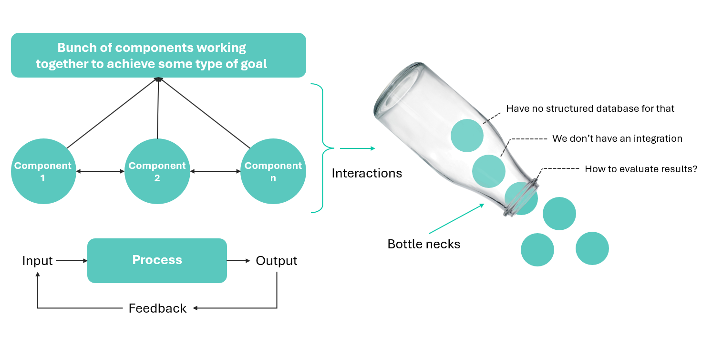

## FIPE (2025-2026)

### [**Business**]{style="color: #9D0F6A ;"}

São Paulo Institute of Economic Research is a Brazilian research institute focused on economic studies, and market analysis.

### [**Activities**]{style="color: #9D0F6A ;"}

Data Scientist

::: panel-tabset

## AS-IS

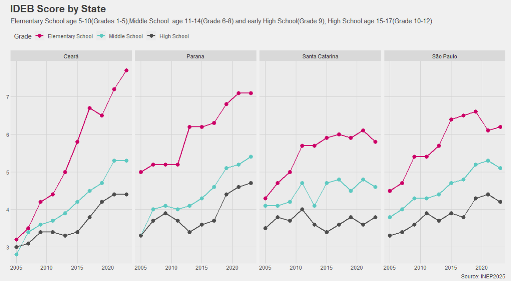

## TO-BE

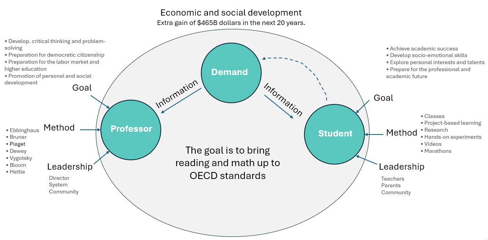

## Framework

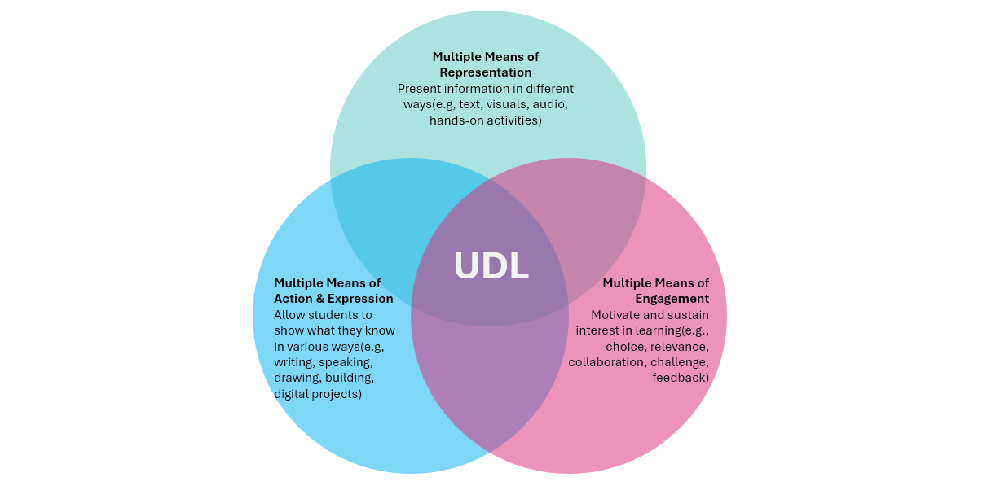

## New Challenges

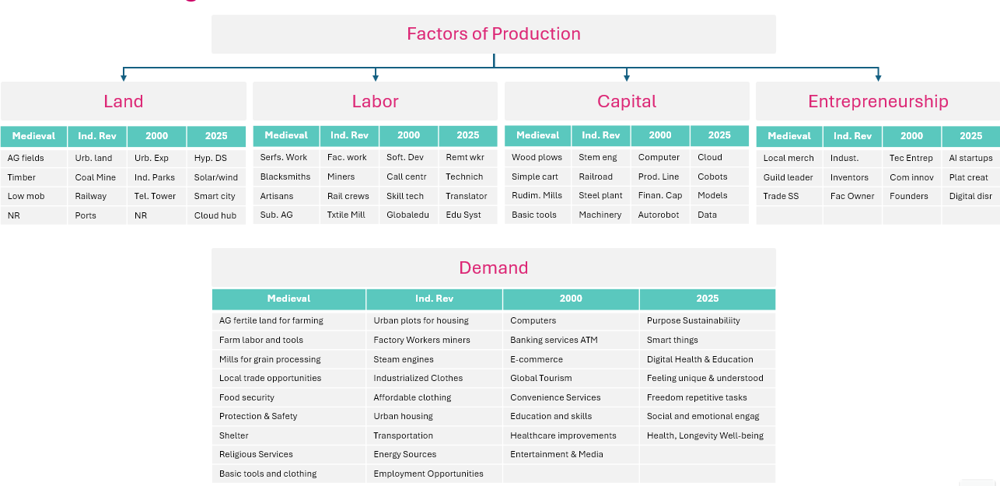

:::
